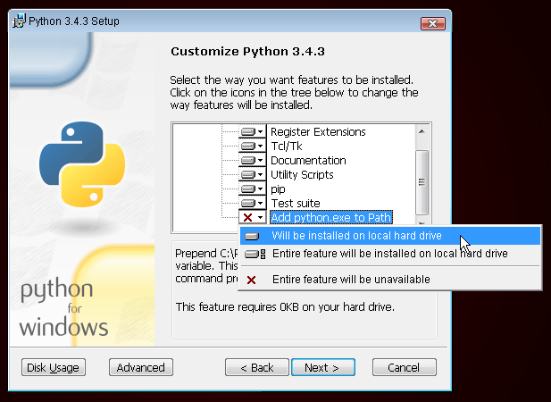

.. _python.org: https://www.python.org/downloads/release/python-343/

Instalacja
==========

Do warsztatów będziemy potrzebować wersji Pythona 3.4. Poniżej znajdują się wskazówki do tego, jak zainstalować środowisko oraz inne potrzebne narzędzia. 

Windows
*******

Możesz ściągnąć Pythona pod Windows z tej strony: _python.org. Po pobraniu pliku *.msi, uruchom go (klikając dwukrotnie na niego) i postępuj według wyświetlanych instrukcji. Koniecznie zapamiętaj ścieżkę (katalog), w którym zainstalowałaś Pythona. Będzie Ci niebawem potrzebna!

Na jedno trzeba zwrócić uwagę: na drugiej stronie instalatora nazwanej "Customize" ("Dostosuj do potrzeb") przewiń na sam dół i wybierz "Add python.exe to the Path" ("Dodaj python.exe do ścieżki systemowej"), tak jak to zostało pokazane na poniższym obrazku:

Linux 
******

Jest bardzo prawdopodobne, że masz już zainstalowanego Pythona wraz z systemem. Aby się upewnić (a także sprawdzić jego wersję) otwórz konsolę i wpisz następujące polecenie:

Jeżeli nie masz zainstalowanego Pythona lub chciałabyś zainstalować go w innej wersji, skorzystaj z jednego z poniższych sposobów:

Debian lub Ubuntu

Wpisz w konsoli poniższe polecenie:

Fedora (do 21)

Użyj następującego polecenia w konsoli:

Fedora (22+)

Użyj następującego polecenia w konsoli:

openSuse

Użyj następującego polecenia w konsoli:

OS X

Przejdź na stronę https://www.python.org/downloads/release/python-343/ i pobierz instalator Pythona:

    Pobierz plik o nazwie Mac OS X 64-bit/32-bit installer,
    Kliknij dwukrotnie na python-3.4.3-macosx10.6.pkg, by uruchomić instalator.

Sprawdź, czy instalacja zakończyła się pomyślnie - otwórz aplikację Terminal i uruchom polecenie:

W razie jakichkolwiek wątpliwości albo jeśli coś poszło nie tak i nie wiesz, co dalej robić - zapytaj mentora lub osobę prowadzącą kurs! Czasami nie wszystko idzie tak, jak powinno i najlepszym wyjściem z sytuacji jest poprosić o pomoc kogoś bardziej doświadczonego.

Zainstaluj edytor kodu
**********************

Tylko który wybrać? To nie takie proste, bo wybór zależy w dużej mierze od tego, czego oczekujesz od swojego edytora. Większość programistów Pythona używa bardzo skomplikowanych i niezwykle bogatych w różne funkcjonalności IDE (z ang. Integrated Development Environments - zintegrowane środowisko deweloperskie), takich jak: PyCharm. Jako osoba początkująca nie potrzebujesz jednak aż tak skomplikowanego edytora. Wystarczy coś prostszego, ale nadal dostatecznie użytecznego.

Poniżej znajdziesz nasze propozycje, ale jeżeli masz taką możliwość, możesz poprosić o rekomendację Twojego coacha -- będzie mu łatwiej pomagać Ci podczas warsztatów.

Gedit

Gedit to open source'owy i darmowy edytor dostępny dla wszystkich systemów operacyjnych. Czasami nie jest jednak zbyt prosty w zainstalowaniu.

Atom

Atom to nowy edytor kodu stworzony przez GitHuba. Jest darmowy, ma otwarte źródła, jest łatwy do zainstalowania i używania. Dostępny na Windowsa, OS X i Linuxa.

Sublime text 2

Sublime Text to bardzo popularny edytor z darmowym okresem testowania. Jest bardzo prosty do zainstalowania i używania, dostępny na wszystkie systemy operacyjne.

Dlaczego instalujemy edytory? 

Może się zastanawiasz dlaczego instalujemy specjalny edytor kodu zamiast używać Notatnika albo Notepada.

Po pierwsze kod musi być napisany zwykłym tekstem (ang. "plain text"), a programy takie jak Word albo Textedit sprawiają, że wyrazy nie są tak naprawdę tylko tekstem - możesz zmieniać ich wielkość, czcionkę czy kolor. Jest to tak zwany sformatowany tekst (ang. rich text), używający różnych formatów, takich jak RTF (Rich Text Format).

Po drugie, edytory kodu zostały specjalnie stworzone do tego, by pisać w nich kod, więc mają wiele przydatnych opcji, takich jak podświetlanie różnych elementów składni języka programowania czy automatyczne dodawanie zamykającego cudzysłowu.

Wszystko to zobaczymy w akcji. Niedługo zaczniesz myśleć o swoim edytorze kodu jako o starym, dobrym przyjacielu :)
