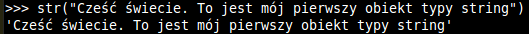
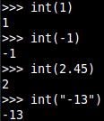
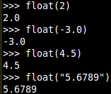
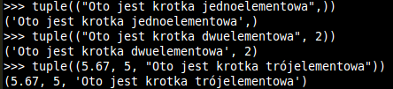
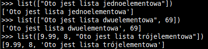
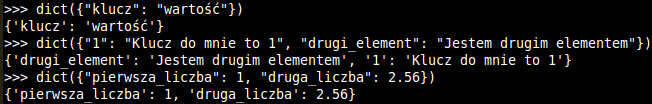
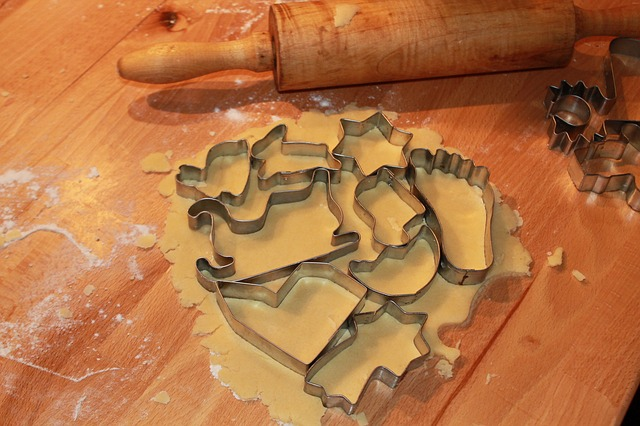
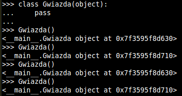

Podstawy programowania obiektowego
==================================

Do poniższych przykładów należy uruchomić konsolę Pythona. Jeśli zajdzie potrzeba napisać kod za pomocą IDE bądź edytora zostaniesz o tym poinformowany. Jeśli nie wiesz jak uruchomić konsolę Pythona zajrzyj do :ref:`how_to`.

Tworzenie obiektu
*****************
Jednym ze sposobów wymiany informacji między ludźmi jest słowo pisane, a więc pierwszym obiektem, który zostanie stworzony będzie napis.

.. literalinclude:: _src/2.1.py
   :language: python
   :lines: 1

Powinno to wyglądać mniej więcej tak.

Pewnie ten kawałek kodu nie spełnia twoich oczekiwań, jednak z programowaniem jest tak jak z pisaniem książek. Nim jakąkolwiek napiszesz najpierw musisz nauczyć się pisać w ogóle.
Ok. Pierwszy krok za nami. Teraz czas stworzyć inne podstawowe obiekty. Na pierwszy ogień rzućmi liczby całkowite, czyli te, które komputer lubi najbardziej.

.. literalinclude:: _src/2.1.py
   :language: python
   :lines: 3-6

Jak się zapewne spodziewasz wynik przepisania wszystkich czterech linii będzie podobny do tego z pierwszego przykładu.

Interpreter dość sprytnie sobie poradził i jak widzimy dostaliścimy liczbę ujemną, liczbę z przecinkiem również udało mu się zamienić na całkowitą podobnie jak napis. Kolejnym podstawowym obiektem są liczby zmiennoprzecinkowe w matymatyce nazywane liczbami rzeczywistymi.

.. literalinclude:: _src/2.1.py
   :language: python
   :lines: 8-11

Po przepisaniu tego kodu powinien twoim oczom ukazać się taki oto wynik.

Trochę bardziej zaawansowanymi typami są krotki, listy [1]_ i słowniki [2]_. A więc przejdźmy do nich zaczynając od krotek.

.. literalinclude:: _src/2.1.py
   :language: python
   :lines: 13-15

Wynik działania tego kodu powinien być następujący.

Warto zauważyć, że w przypadku krotki jednoelementowej na końcu znalazł się przecinek. Nie jest on tam bez powodu. Po prostu załóż, że zawsze w krotce jednoelementowej na końcu musi znajdować się przecinek. A teraz przejdźmy do listy.

.. literalinclude:: _src/2.1.py
   :language: python
   :lines: 17-19

Poniżej znajduje się wynik działania kodu przedstawionego powyżej.

Jak widać lista podobnie jak krotka nie wybrzydza i można do niej tak samo jak do krotki wsadzać liczby jak i napisy. A teraz przejdźmy do słowników.

.. literalinclude:: _src/2.1.py
   :language: python
   :lines: 21-23

Przyjrzyjmy się wynikowi działania tego kodu.

Podobnie jak w przypadku list czy krotek utworzyliśmy sobie trzy obiekty. Tylko w przeciwieństwie do list i krotek gdzie kolejne wartości były obok siebie tak w przypadku słowników mamy wyświetlone klucz - wartość.

Skoro wiesz już wszystko o podstawowych typach danych czas abyś mógł to przetestować na własnej skórze. Oto kilka prostych zadań:

1. Stwórz obiekt liczy całkowitej z dowolną wartością większą od 100.
2. Stwórz obiekt zmiennoprzecinkowej z dowolną wartością z zakresu od 0 do 1.
3. Stwórz napis, w którym znajdzie się powitanie w dowolnym obcym języku.
4. Stwórz krotkę składającą się z 4 napisów.
5. Stwórz listę składającą się z 5 liczb.
6. Stwórz słownik, w którym będą 4 pary klucz - wartość. Dwie z wartości mają być twoim imieniem i nazwiskiem, jedna wzrostem i jedna wiekiem.

Zadeklarujmy własny typ obiektu
*******************************

Aby efektywnie programować wykorzystując paradygmat obiektowy należy wykorzystywać wszystkie jego elementy. W trakcie nauki spotkasz wiele pojęć, które do tej pory są przez ciebie kojarzone pewnie z innymi dziedzinami np. z biologią. Na razie zajmiemy się pojęciem klasy i obiektu.
Otóż klasa jest dla komputera zbiorem ogólnych informacji na podstawie, który będą tworzone obiekty danej klasy. Najlepszym realnym odzwierciedleniem są formy na ciasteczka i ciasteczka.

Forma jest tu klasą. Otóż z jednej formy można stworzyć ogromną ilość ciastek, które wyglądają tak samo, choć ostatecznie po upieczeniu będą różnić się szczegółami np. jedno ciasteczko lepiej wyrośnie a inne się troszkę przypali. Na powyższym rysunku jedną z form jest gwiazda. A więc dla przykładową klasą będzie gwiazda.

.. literalinclude:: _src/2.2.py
   :language: python
   :lines: 1-2

Powyższy kawałek kodu odpowiada za stworzenie pustej klasy. Pierwsza linia odpowiada za definicję klasy natomiast w drugiej linii przerywamy jej definicję aby została ona pusta. Dobrą praktyką jest również nadawanie nazw, które nie posiadają polskich liter tj. ą, ć i pozostałych. Chwilowo nie ma potrzeby definiować żadnej skomplikowanej klasy. Później klasa gwiazdy zostanie rozwinięta o dodatkowe elementy, ale na razie spokojnie. Zwróć uwagę, że przed słowem kluczowym **pass** znajdują się 4 spacje. Skoro istnieje już definicja klasy czas stworzyć obiekty tej klasy.

.. literalinclude:: _src/2.2.py
   :language: python
   :lines: 4-7

Przepisanie całego powyższego kodu powinno dać wynik taki jak poniżej.

Póki co stworzenie obiektu klasy Gwiazda nie daje żadnych ciekawych efektów ale wszystko po kolei. Przyjrzyj się wszystkim wynikom, które zostały wyświetlone na konsoli. Zauważ, że choć obiekty tworzone były jeden za drugim różnią się one od siebie drobnym szczegółem; numerem na końcu wyświetlanej informacji. Każdy tworzony obiekt otrzymuje taki numer i jest on unikalny. Mam nadzieję, że teraz analogia do formy i ciastek jest zrozumiała.

Nie jest to koniec tematu klas i obiektów, jednak na daną chwilę więcej nie musisz wiedzieć. Za to są dla ciebie proste zadania:

1. Stwórz pustą klasę Kometa.
2. Stwórz pustą klasę Koń.
3. Stwórz pustą klasę Świnia.

:ref:`lies_chapter_1`

Przypisy
*********
.. [1] Listy nazywane są czasem tablicami.
.. [2] Słowniki nazywane są czasem tablicami asocjacyjnymi.
